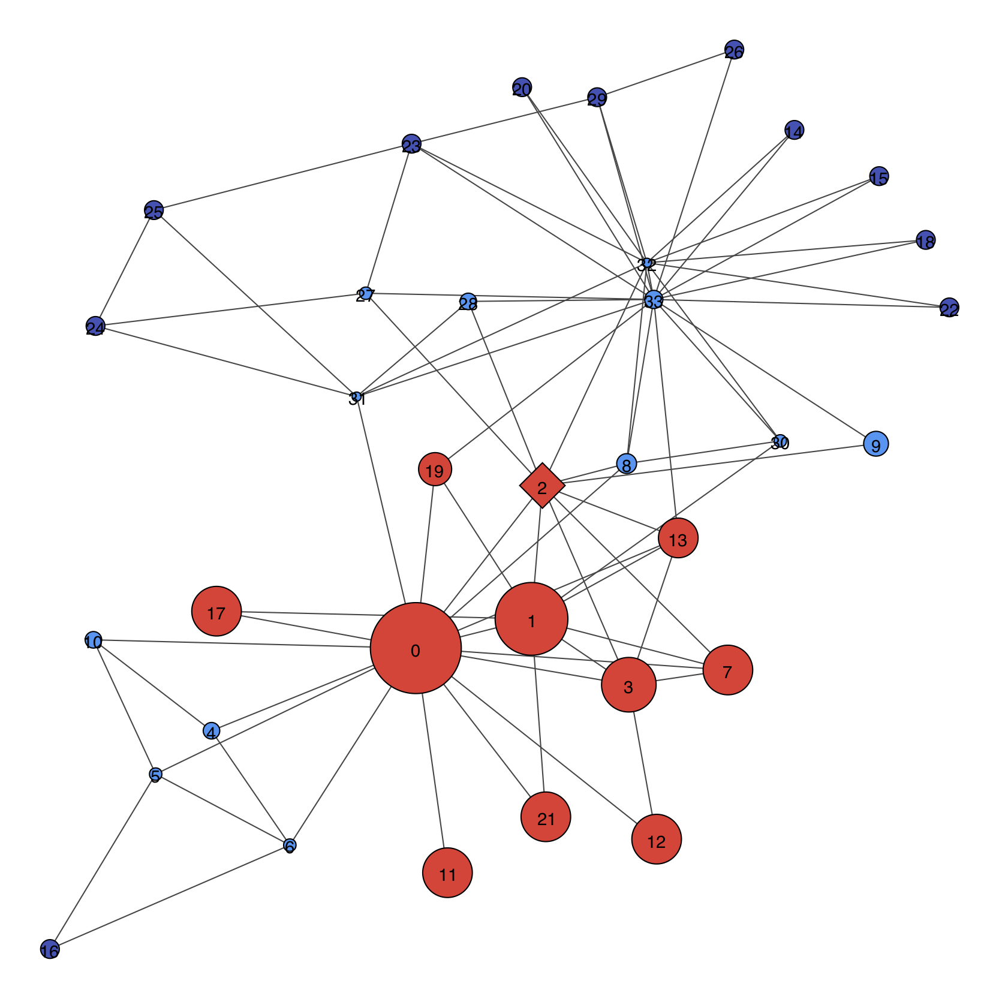

[](https://doi.org/10.21105/joss.00960) [](https://doi.org/10.5281/zenodo.1443550)
[](https://pepy.tech/project/localclustering)

# LocalClustering

The project implements multiple variations of a *local* graph clustering algorithm named the *Hermina-Janos algorithm* in memory of my beloved grandparents.

Graph cluster analysis is used in a wide variety of fields. This project does not target one specific field, instead it aims to be a general tool for graph cluster analysis for cases where global cluster analysis is not applicable or practical for example because of the size of the data set or because a different (local) perspective is required.

The algorithms are independent of the cluster definition. The interface cluster definitions must implement can be found in the `definitions` package along with a simple connectivity based cluster definition implementation. Besides the algorithms and the cluster definition, other utilities are also provided, most notably a module for node `ranking`.

## Installation

Install the latest version of the project from the Python Package Index using `pip install localclustering`.

## Getting started

This section will guide you through the basics using `SQLAlchemy` and the `IGraphWrapper` graph implementation from `graphscraper`. `IGraphWrapper` requires the `igraph` project to be installed. You can do this by following the instructions on [this page](http://igraph.org/python/).

Once everything is in place, the analyzed graph can be created:

```Python
import igraph
from graphscraper.igraphwrapper import IGraphWrapper

graph = IGraphWrapper(igraph.Graph.Famous("Zachary"))
```

The next step is the creation of the cluster definition and the preparation of the clustering algorithm:

```Python
from localclustering.definitions.connectivity import ConnectivityClusterDefinition
from localclustering.localengine import LocalClusterEngine

cluster_definition = ConnectivityClusterDefinition(1.5, 0.85)
local_cluster_engine = LocalClusterEngine(
    cluster_definition,  # The cluster definition the algorithm should use.
    source_nodes_in_result=True,  # Ensure that source nodes are not removed from the cluster.
    max_cluster_size=34  # Specify an upper limit for the calculated cluster's size.
)
```

Now the source node of the clustering must be retrieved:

```Python
source_node = graph.nodes.get_node_by_name("2", can_validate_and_load=True)
```

And finally the cluster analysis can be executed:

```Python
cluster = local_cluster_engine.cluster([source_node])
```

Additionally you can list the nodes inside the cluster with their rank to get an overview of the result:

```Python
rank_provider = local_cluster_engine.get_rank_provider()
for node in cluster.nodes:
    print(node.igraph_index, rank_provider.get_node_rank(node))
```



## Additional resources

In addition to the software, a detailed [description](documents/algorithm.rst) and an in-depth [evaluation](documents/Algorithm%20Analysis%20with%20the%20Spotify%20Related%20Artists%20Graph.ipynb) of the algorithms is also provided.

Furthermore, a `demo` module showing the basic usage of the project is also available.

## Community guidelines

Any form of constructive contribution is welcome:

- Questions, feedback, bug reports: please open an issue in the issue tracker of the project or contact the repository owner by email, whichever you feel appropriate.
- Contribution to the software: please open an issue in the issue tracker of the project that describes the changes you would like to make to the software and open a pull request with the changes. The description of the pull request must references the corresponding issue.

The following types of contribution are especially appreciated:

- Implementation of new cluster definitions.
- Result comparison with global clustering algorithms on well-known and -analyzed graphs.
- Analysis of how cluster definitions should be configured for graphs with different characteristics.
- Analysis of how the weighting coefficients of the connectivity based cluster definition corresponding to the different hierarchy levels relate to each-other in different real-world graphs.

## License - GNU AGPLv3

The library is open-sourced under the conditions of the GNU Affero General Public [License](https://choosealicense.com/licenses/agpl-3.0/) v3.0, which is the strongest copyleft license. The reason for using this license is that this library is the "publication" of the *Hermina-Janos algorithm* and it should be referenced accordingly.
