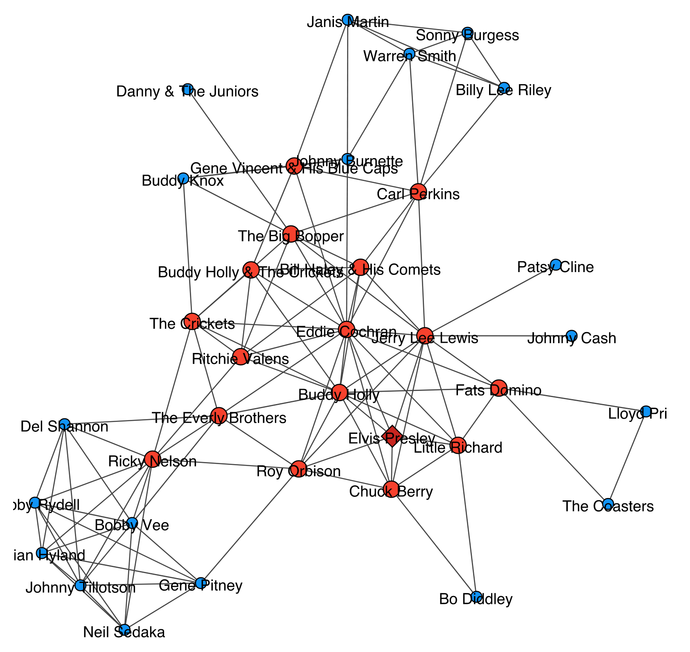

# Introduction

Graph clustering algorithms aim to divide the nodes of a graph into one or more clusters based on some measure of similarity. There are many different ways to define a cluster depending on the goal of the analysis. In graph cluster analysis the usual definition of a cluster is a group of nodes that are relatively densely interconnected but have few connections towards nodes outside of the cluster.

For an overview of graph clustering algorithms see [@Schaeffer:2007]. The more developed field within graph clustering is global clustering. Global algorithms are allowed to look at the whole graph while calculating its clusters. Well known global clustering algorithms include [@Blondel:2008], [@Dongen:2000], [@Newman:2004], [@Newman:2006], [@Pons:2006] and [@Raghavan:2007].

Local clustering algorithms get a small set of source nodes (typically a single node) as input and calculate the cluster they belong to in the graph. While doing so, local algorithms are only allowed to look at the already visited nodes of the graph and their neighbours.

Graph cluster analysis is used in a wide variety of fields. This project does not target one specific field, instead it aims to be a general tool for graph cluster analysis for cases where global cluster analysis is not applicable or practical for example because of the size of the data set or because a different (local) perspective is required.

# Algorithm

This Python project implements the (hierarchical) Hermina-Janos local clustering algorithm. The algorithm is independent of the used cluster definition, instead it defines an [interface](src/localclustering/definitions/base.py) which cluster definitions must implement. One such cluster definition, a simple connectivity based one, is available as part of the project and it was used to generate the example figure as well as all other results that can be found in the repository.

The following sections provide a high-level overview of the algorithm and cluster definition. For more details and analysis, please see the [algorithm description](documents/algorithm.rst) and [IPython notebook](documents/Algorithm%20Analysis%20with%20the%20Spotify%20Related%20Artists%20Graph.ipynb) that are provided as part of the project.

## Local clustering algorithm

The Hermina-Janos algorithm is a simple iterative process that repeats the following two steps until it reaches a stable state:

1. Expansion step: For each node in the neighbourhood of the cluster, decide whether adding it to the cluster would increase the cluster's quality, collect all the neighbours whose addition would improve the cluster and add them to the cluster in one step.
2. Reduction step: For each node on the border of the cluster, decide whether removing it from the cluster would increase the cluster's quality, collect all the nodes whose removal would improve the cluster and remove them from the cluster in one step.

The process can be thought of as a sort of label propagation [@Raghavan:2007], where the cluster competes against its surroundings until an equilibrium is reached.

## Hierarchical local clustering algorithm

The hierarchical version of the Hermina-Janos local clustering algorithm extends the base version with an extra layer that allows it uncover clusters at different hierarchy levels or "distances" from the source nodes of the cluster analysis.

Similarly to the base algorithm, the hierarchical Hermina-Janos algorithm is also an iterative process with the following two steps:

1. Local clustering step: Use the Hermina-Janos local clustering algorithm with the current configuration of the used cluster definition to calculate the cluster.
2. Cluster definition relaxation step: This is a highly cluster definition-dependent step where the algorithm adjusts or relaxes the cluster definition's parameters so in the next iteration the local clustering algorithm will be able to further extend the cluster.

## Cluster definitions

Cluster definitions must implement a cluster quality metric such as min-cut in a way that allows them to answer the following two questions for the clustering algorithms:

* Given a node that is in the neighbourhood of the cluster and the cluster itself, would adding the node to the cluster improve the cluster's quality?
* Given a node that is in the cluster and the cluster itself, would removing the node from the cluster improve the cluster's quality?

Furthermore, for a cluster definition to be hierarchical, it must be able to adjust or relax its parameters and to do so in a way that allows more nodes to be included in the cluster during the next local clustering iteration with the definition.

### Connectivity based cluster definition

The connectivity based cluster definition is the default cluster definition implementation in this project that also happens to be a hierarchical one.

The cluster definition broadly works the following way:

1. It calculates the *quality difference* the node provides or would provide for the cluster.
2. It calculates the minimum quality difference - the *threshold* - to compare the quality difference to.
3. *Addition*: if the quality difference of the addition is greater than or equal to the threshold, then the node should be added. *Removal*: if the quality difference of the removal is less than the threshold, then the node should be removed.

The cluster definition has the following configurable parameters:

* *Weighting coefficient*: An edge weight multiplier for the edges that have at least one of their endpoints within the cluster. This is the parameter the cluster definition adjusts during hierarchical clustering.
* *Threshold modifier*: The calculated base threshold is multiplied by the value of this parameter before being used to make a decision regarding a given node.

The quality difference is calculated in the following way: sum the edge weights multiplied by the weighting coefficient for each edge that connects the given node to the cluster.

The threshold is calculated in the following way: take the minimum of the following values and multiply it by the threshold modifier:

* Half the number of nodes in the cluster minus 1.
* Half the degree of the given node.
* The sum of the degrees of the nodes within the cluster divided by 2 times the number of nodes within the cluster.

The cluster definition adjusts itself to the next hierarchy level by finding the value to multiply the weighting coefficient with in order for the cluster definition to be able to include at least one more node in the cluster.

For more details, please see the implementation.

# Tools and utilities

The project provides a ranking component that can be used to rank the nodes in the cluster and their neighbours by their importance or contribution to the cluster (as defined by the used cluster definition).

A component for recording the steps the algorithms have taken is also provided. It makes it possible to trace back each decision and step the algorithms have made to see exactly how the result was calculated.

# Ideas for future work

- Reimplementation for parallel computing: Most of the calculations the algorithms make (the only exception being the actual cluster update) can be executed in parallel, that could significantly improve performace.
- New cluster definitions: Only one cluster definition is provided in the project. More cluster definitions can be implemented for example by building on cluster quality metrics such as modularity [@Newman:2004].
- Analysis of how cluster definitions should be configured for graphs with different characteristics.
- Result comparison with global clustering algorithms on well-known and -analyzed graphs such as the Zachary karate club [@Zachary:1977].

# References
